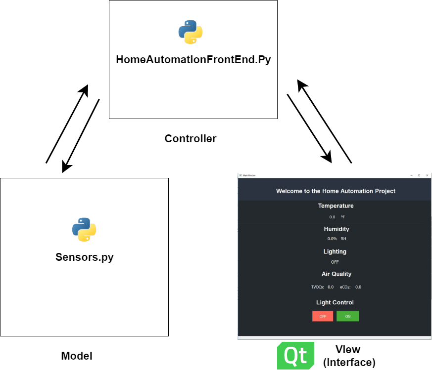

# Home Automation Hub for Monitoring and Controlling Living Conditions

In the home automation hub, the user has the ability to view room condition variables. The project provides the user with a comprehensive digital view of their living conditions, including: temperature, humidity, lighting, and air quality. This allows a homeowner, business-owner, or owner of any space to monitor the conditions of that space for optimal comfort and safety.

###### **Technologies**:
- QT, 
- Python with Pyside2,
- Respberry Pi model 3B+,
- Temperature Sensor,
- Humidity Sensor
- Light Sensor,
- Air Quality Sensor

## System Architecture

